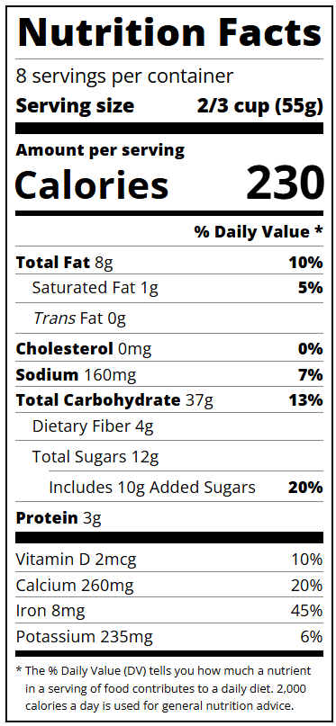

# Nutrition Label

A responsive nutrition label project built using HTML and CSS as part of the FreeCodeCamp Responsive Web Design certification course.

## Description

This project presents a nutrition label formatted according to standard guidelines, showcasing nutritional information per serving. Created as part of the FreeCodeCamp curriculum, I implemented a responsive design that adapts to various screen sizes, ensuring readability and usability on both desktop and mobile devices.

## Features

- Responsive design that adjusts to different screen sizes.
- Clear display of nutritional information, including calories, fats, carbohydrates, and more.
- Use of Flexbox for alignment and spacing to enhance the layout.
- Stylish dividers and typography to improve visual appeal.

## Technologies Used

- HTML
- CSS

## How to Run

1. Clone the repository to your local machine.
2. Open `nutritionLabel.html` in your web browser.

## Acknowledgments

This project was completed as part of the FreeCodeCamp Responsive Web Design certification course. Special thanks to FreeCodeCamp for providing the resources and guidance.
